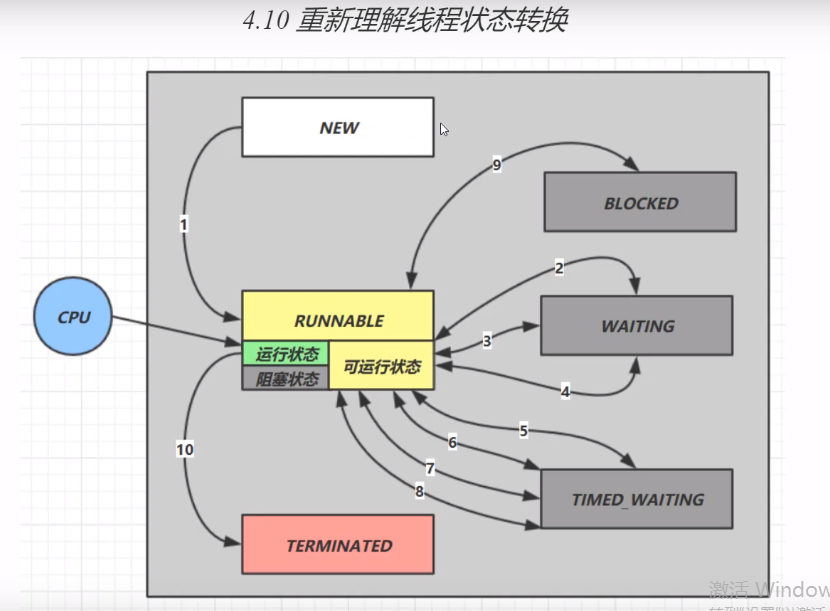

# thread
并发编程学习

每个线程有自己独立的栈内存

synchronized 加到静态方法上是对类对象加锁

局部变量是存在栈帧中，是私有的

#park和unpark

执行park使线程处于等待
unpark即可以在park之前调用，也可以在park之后调用

####park和Object的wait和notify相比
wait,notify和notifyAll必须配合Object Monitor 一起使用，而park,unpark不必
park和unpark是以线程为单位来【阻塞】和【唤醒】线程，而notify只能唤醒一个等待的线程，notifyAll
是唤醒所有的等待线程，就不那么【精确】
park和unpark可以先unpark,而wait和notify不能先notify

